# SYSTEM ARCHITECTURE — GIT-DRIVEN DEPLOYMENT ENGINE WITH AI FAILURE SUMMARY
**Automated CI/CD Deployment, Intelligent Failure Analysis and Centralized Monitoring**

---

## 1. High-Level Architecture Canvas

```text
┌───────────────────────────────────────────────────────────────────────────────┐
│                         GIT-DRIVEN DEPLOYMENT ENGINE                          │
│                         WITH AI FAILURE SUMMARY                               │
├───────────────────────────────────────────────────────────────────────────────┤
│                                                                               │
│  USER/SOURCE       CI/CD ORCHESTRATION       DEPLOYMENT        AI ANALYSIS    │
│                                                                               │
│                                                                               │
│                         CENTRAL BACKEND/API                                   │
│                                                                               │
│                    DATABASE + CLOUD STORAGE                                   │
│                                                                               │
│                         DASHBOARD / ALERTS                                    │
│                                                                               │
└───────────────────────────────────────────────────────────────────────────────┘
```

## 2. System Architecture Diagram

*(This diagram uses Mermaid.js to render a production-quality cloud and CI/CD architecture. It is fully viewable in Markdown previewers like GitHub, VS Code, or Typora.)*

```mermaid
flowchart LR
    %% Visual Design & Styling
    classDef default fill:#f9f9f9,stroke:#ced4da,stroke-width:1px,color:#212529;
    classDef dev fill:#e9ecef,stroke:#adb5bd,stroke-width:2px,color:#495057;
    classDef github fill:#24292e,stroke:#24292e,stroke-width:2px,color:#fff;
    classDef backend fill:#e3f2fd,stroke:#90caf9,stroke-width:2px,color:#0d47a1;
    classDef cicd fill:#fff3e0,stroke:#ffb74d,stroke-width:2px,color:#e65100;
    classDef docker fill:#e1f5fe,stroke:#29b6f6,stroke-width:2px,color:#01579b;
    classDef aws fill:#ff9900,stroke:#232f3e,stroke-width:2px,color:#232f3e;
    classDef monitor fill:#f8f9fa,stroke:#6c757d,stroke-width:2px,color:#343a40;
    classDef success fill:#d4edda,stroke:#28a745,stroke-width:2px,color:#155724;
    classDef fail fill:#f8d7da,stroke:#dc3545,stroke-width:2px,color:#721c24;
    classDef ai fill:#f3e5f5,stroke:#ce93d8,stroke-width:2px,color:#4a148c;
    classDef db fill:#336791,stroke:#295273,stroke-width:2px,color:#fff;
    classDef dashboard fill:#20c997,stroke:#1aa179,stroke-width:2px,color:#fff;
    classDef ui fill:#ffffff,stroke:#20c997,stroke-width:2px,color:#20c997;

    %% 1. Developer Layer
    Dev(("Developer")):::dev

    %% 2. Source Control
    subgraph SC [SOURCE CONTROL]
        Git["GitHub / GitLab<br/>Repository, Code, PR, Merge"]:::github
    end

    %% 3. Webhook & Backend
    subgraph BE [DEPLOYMENT ENGINE]
        WH("Webhook Handler<br/>(Flask + Python)"):::backend
        API["Flask REST API<br/>Requests, Project Mgmt"]:::backend
        PC["Pipeline Controller<br/>Build & Test Control"]:::backend
        DC["Deployment Controller<br/>Environment Setup"]:::backend
        LM["Log Manager<br/>Log Processing"]:::backend
    end

    %% 4. CI/CD Pipeline
    subgraph CICD [CI/CD PIPELINE - GitHub Actions / Jenkins / GitLab CI/CD]
        direction LR
        Bld["Build"]:::cicd --> Tst["Automated Testing"]:::cicd --> Pkg["Package"]:::cicd --> Img["Docker Image"]:::cicd
    end

    %% 5. Container Execution
    subgraph DKR [DOCKER EXECUTION ENVIRONMENT]
        DEng{"Docker Engine<br/>Isolated Execution"}:::docker
        subgraph Cont [Containers]
            BC["Build Container"]:::docker
            TC["Test Container"]:::docker
            AC["Application Container"]:::docker
        end
    end

    %% 6. AWS Deployment
    subgraph AWS [AWS DEPLOYMENT ENVIRONMENT]
        EC2["AWS EC2<br/>Running Containers"]:::aws
        CW["AWS CloudWatch<br/>Monitoring / Metrics / Logs"]:::aws
    end

    %% 7. Monitor
    subgraph MON [DEPLOYMENT MONITOR]
        DM["Deployment Monitor<br/>Build, Test & Runtime Status"]:::monitor
    end

    %% 8. Database Layer
    subgraph DB_Zone [DATA STORAGE]
        DB[("PostgreSQL<br/>Users, Projects, Deployments")]:::db
        S3[("AWS S3<br/>Logs, Artifacts, Objects")]:::aws
    end

    %% 9. Dashboard & UI
    subgraph UI_Zone [DEVELOPER DASHBOARD & ADMIN]
        Dash["DEVELOPER DASHBOARD<br/>(React.js + Bootstrap)"]:::dashboard
        Admin["ADMIN PANEL<br/>User & Repo Mgmt"]:::ui
        Notif(("Notification Service")):::ui
    end

    %% 10. AI Analysis
    subgraph AIF [AI-BASED FAILURE ANALYSIS]
        FL["Log Collection Module<br/>Failure Logs"]:::fail
        subgraph NLP [AI / NLP Log Analysis]
            direction TB
            Pre["Log Preprocessing"]:::ai
            Err["Error Extraction"]:::ai
            Pat["Failure Pattern Detection"]:::ai
            Root["Root Cause Identification"]:::ai
            Summ["AI Failure Summary Generator"]:::ai
            Pre --> Err --> Pat --> Root --> Summ
        end
    end

    %% -- CONNECTIONS --
    
    Dev -- "Code Changes / Git Push" --> Git
    Git -- "Webhook Event" --> WH
    
    WH --> API
    API --> PC
    PC --> DC
    DC --> LM
    
    PC -- "Pipeline Trigger" --> Bld
    Img -- "Build / Test" --> DEng
    DEng -.-> BC & TC & AC
    
    DC -- "Deploy Application" --> EC2
    DEng -- "Execute" --> EC2
    EC2 -. "Logs" .-> CW
    
    EC2 -- "Status" --> DM
    
    %% Success/Failure Paths
    Succ{"Deployment Successful"}:::success
    Fail{"Deployment Failed"}:::fail
    
    DM -- "Success" --> Succ
    DM -- "Failure" --> Fail
    
    Fail --> FL
    FL -- "Build Logs, Stack Traces, Error Messages" --> Pre
    
    %% Database Connections
    API -. "Reads/Writes" .-> DB
    LM -. "Stores Logs" .-> S3
    Summ -. "Stores Summary" .-> DB
    
    %% Dashboard & Notifications Connections
    Dash -. "REST API" .-> API
    Admin -. "REST API" .-> API
    
    Succ -- "Status Update" --> Dash
    Succ -- "Success Notification" --> Notif
    
    Summ -- "Probable Root Cause" --> Dash
    Summ -- "Failure Alert" --> Notif

    %% Security Layer (Subtle visual support)
    subgraph SEC [SECURITY LAYER]
        Sec["Authentication, Authorization, Secure Webhooks, API Security, Secrets"]:::default
    end
    API -. "Secured By" .- Sec
```



## 3. Architecture Component Breakdown

### Zone 1: Developer & Source Control
The starting point of the architecture. Developers commit and push code changes directly to **GitHub / GitLab**. This acts as the single source of truth for the codebase and triggers downstream processes via webhook events upon Pull Requests or Merges.

### Zone 2: Webhook & Backend (Deployment Engine)
The **Flask REST API** serves as the central backend orchestrator. A dedicated **Webhook Handler** listens for incoming repository events and initiates the **Pipeline Controller**, which oversees the build and test lifecycle. The **Deployment Controller** manages environment specific execution, while the **Log Manager** captures system and application logs.

### Zone 3: CI/CD Orchestration
This layer represents integrated platforms like **GitHub Actions, Jenkins, or GitLab CI/CD**. The pipeline strictly follows the sequence of: *Build → Automated Testing → Package → Docker Image*.

### Zone 4: Containerized Execution
Built upon **Docker Engine**, this environment guarantees isolated execution. Separate containers exist for building, testing, and running the application, ensuring consistency across environments.

### Zone 5: AWS Cloud Deployment Environment
The cloud infrastructure is hosted on AWS. **AWS EC2** instances run the application containers, while **AWS CloudWatch** continuously monitors metrics, performance, and application logs.

### Zone 6: Deployment Monitoring (Success vs. Failure)
The **Deployment Monitor** observes the execution environment to determine the runtime status.
* **Success Path (Green):** Updates the dashboard with a success status and triggers a developer notification.
* **Failure Path (Red):** Triggers the Log Collection Module to aggregate build logs, stack traces, and execution data for AI analysis.

### Zone 7: AI-Based Failure Analysis
The core novelty of the architecture. When a failure occurs, logs are passed to the **AI/NLP Log Analysis** module, which processes data through five steps: *Log Preprocessing → Error Extraction → Failure Pattern Detection → Root Cause Identification → AI Failure Summary Generator*. This creates human-readable failure insights.

### Zone 8: Data Storage
* **PostgreSQL:** Stores structured data including user profiles, project details, deployment records, and AI summaries.
* **AWS S3:** Acts as robust object storage for large deployment artifacts and historical log files.

### Zone 9: Developer Dashboard & Notifications
The frontend is built with **React.js + Bootstrap**. It provides real-time visibility into deployment statuses, AI failure summaries, and overall system health. A dedicated **Admin Panel** exists for configuration and user management, while the **Notification Service** alerts developers of pipeline outcomes.

### Zone 10: Security Layer
A fundamental layer enclosing the system, responsible for Authentication, Authorization, Secure Webhooks, and Secrets management to ensure robust access control and execution isolation.

---
*Generated for B.Tech Project Documentation, Synopsis, and Presentation.*
